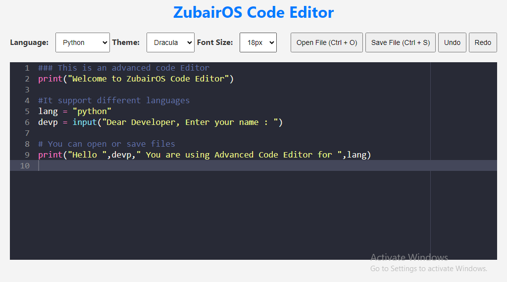
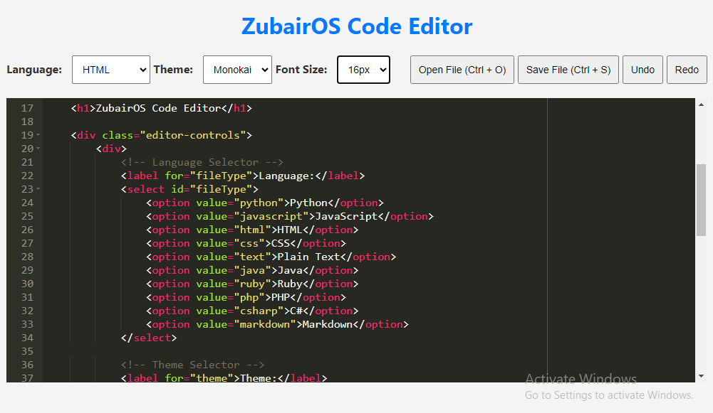

# ZubairJammu Code Editor

ZubairJammu Code Editor is a simple web-based code editor built using the Ace editor library. It allows users to write and edit code in various programming languages with syntax highlighting and other useful features. [Try it online](https://zubairjammu786.github.io/codeeditor/)
## Features

- Language selection for syntax highlighting.
- Theme customization for a personalized coding experience.
- Adjustable font size to suit your preferences.
- File opening and saving functionality.
- Undo and redo operations.

## Screenshots



## Developer
Zubair Jammu

## Credits
This project uses the [Ace editor](https://github.com/ajaxorg/ace) library for code editing.

## How to Use
1. Clone the repository:

   ```bash
   git clone https://github.com/zubairjammu786/ZubairJammu-Code-Editor.git
